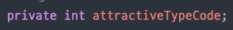

### 필수 미션 요구사항 분석 & 체크리스트
- CASE4 : 중복 호감표시 X
- CASE5 : 11명 이상의 호감 상대 등록 X
- CASE6 : CASE4에서 기존의 사유와 다른 사유로 호감을 표시하는 경우에는 성공 처리

#### CASE 5
- [X] 호감 표시 등록 시 로그인 한 유저가 호감 표시를 한 인원 수 count
- [X] count한 인원이 10명 이상이라면 더 이상 등록 못하므로 예외 처리

#### CASE 4, 6
- [X] 호감 표시 등록 시 이미 호감 표시를 한 사람인지 확인
- [X] 이미 호감 표시를 등록한 사람이라면 attractiveTypeCode가 수정됐는지 확인
- [X] attractiveTypeCode가 같다면 "이미 등록된 사람~~" 예외 처리
- [X] attractiveTypeCode가 다르다면 update 쿼리 발생 및 "~님에 대한 호감사유 변경" 메시지 처리 

#### LikeablePersonServiceTest
- [X] 각각의 케이스에 대한 응답 코드 및 메시지를 테스트

---
### 선택미션 - 네이버 소셜 로그인
- [X] application.yml에 인증 정보 추가
- [X] Naver Resource Server로부터 받은 데이터 중 response의 email만 뽑아내기
  
---

### 2주차 미션 요약

#### **[접근 방법]**
- 일단 생각나는 대로 무작정 구현.
- 위캔에 올라온 SQL 쿼리를 보면서 내가 만든 메서드의 동작 쿼리와 비교
- 리팩토링 진행

#### **[특이사항]**

**선택미션 삽질**
- Naver OAuth2를 통해 받은 id 값은 Base64 형식이라 문자가 지저분함.
  
- 이 문자를 디코딩하여 깔끔하게 만들고자 시도했지만 실패
- ChatGpt한테 디코딩을 시켰는데 결과가 다음과 같이 나왔다.

- 확인해보니, 애초에 숫자가 아닌 문자열을 Base64 형식으로 인코딩한거라 이상하게 나오는 것 같다.
- 최종적으로, 네이버 로그인의 경우, email을 id로 설정했다.
  

**[Refactoring]**

  

