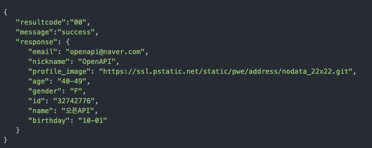

# 필수미션
## 필수미션1 
- [X] : application-prod.yml의 baseUrl 세팅
- [X] : 카카오, 네이버, 구글, 페이스북의 개발자 페이지에서 도메인에 맞는 Redirect Uri 추가
- [X] : [https://www.codelionbigsand.shop](https://www.codelionbigsand.shop)

## 필수미션2, 선택미션2
### ToListSearchForm
- [X] : 클라이언트의 요청으로 받는 쿼리 파라미터들을 필드로 설정
- [X] : `Integer`로 선언하여 빈 문자가 들어왔을 때 스프링의 데이터 바인딩에 의해 `null`값으로 처리 된다.

### LikeablePersonController
- [X] : 성별과 호감사유 쿼리스트링을 저장하는 데이터 전송 객체를 매개변수로 받는다.
- [X] : likeablePersonService로 현재 접속한 사용자의 인스타 아이디와 
데이터 전송 객체를 보내서 likeablePerson list를 받는다.

### LikeablePersonService
- [X] : 컨트롤러로부터 받은 파라미터를 리포지토리로 보내주고 리스트를 반환받는다.

### LikeablePersonRepositoryCustom
- [X] : 받은 파라미터를 통해 likeablePerson list를 반환하는 동적 쿼리 메서드 생성
### LikeablePersonRepositoryImpl
- [X] : 위의 메서드를 오버라이드해서 구현한다.
- [X] : 파라미터로 받은 성별과 호감사유를 통해 적절한 동적 쿼리 생성
- [X] : `BooleanExpression`을 통해 where에 적절한 조건문 생성
- [X] : 동적 쿼리를 통해 생성한 likeablePerson list를 반환한다.

---

# 선택미션1
## 선택미션1
- 젠킨스를 통해서 리포지터리의 main 브랜치에 커밋 이벤트가 발생하면 자동으로 배포가 진행되도록
- 리포지터리의 main 브랜치에 커밋 이벤트가 발생하면 자동으로 배포가 진행

## 선택미션3
- 내가 받은 호감리스트(/usr/likeablePerson/toList)에서 정렬기능 
- 성별 순과 호감 사유순은 정렬 조건이 두 가지이기 때문에 `OrderSpecifier[]` 배열을 리턴하도록 구현했다.
  - [X] 최신순(기본)
    - `likeablePerson.id`를 기준으로 내림차순으로 정렬 
  - [X] 날짜순
    - `likeablePerson.createDate`를 기준으로 오름차순으로 정렬
  - [X] 인기 많은 순
    - `instaMemberBase`에 likes 필드를 추가함.
    - 호감 표시, 삭제 시 이벤트 리스너를 통해 likes 필드의 값을 갱신
    - `likeablePerson.fromInstaMember.toLikeablePeople.size()` 내림차순 정렬
  - [X] 인기 적은 순
    - `likeablePerson.fromInstaMember.toLikeablePeople.size()` 오름차순 정렬
  - [X] 성별순
    - 남자는 "M" 여자는 "W" 이므로 내림차순으로 정렬해야 여자가 더 상위에 뜬다.
    - 2순위 정렬 조건인 최신순은 `likeablePerson.id`를 기준으로 내림차순 정렬
  - [X] 호감사유순
    - 외모, 성격, 능력 코드가 1, 2, 3이므로 오름차순으로 정렬하면 맞다.
    - 2순위 정렬 조건인 최신순은 `likeablePerson.id`를 기준으로 내림차순 정렬

---

## 4주차 미션 요약

### **[접근 방법]**
- 성별만을 필터링하는 필수미션2를 진행할때는 spring data jpa를 이용해서 구현했었음.
- 하지만, 호감 사유 필터링이 추가되면서 2개의 파라미터에 대한 동적 쿼리 생성이 필요해짐.
- 동적 쿼리를 구현했지만, 파라미터가 null(빈)값일 때 `attractiveTypeCode`는 원시 타입이기때문에 예외 발생

- `BooleanExpression`을 통해 파라미터를 처리하면 null값 일 경우 where 조건절에서 해당 쿼리문을 삭제하기 때문에 정상 작동 
- 선택미션3의 정렬 기능은 `sortCode`에 따른 적절한 정렬 기준 `OrderSpecifier` 배열을 반환하는 메서드를 작성했다.

### **[특이사항]**
- 데이터 전달 객체인 `ToListSearchForm`를 컨트롤러부터 리포지토리까지 전송하는데 이게 효율적인 전달 방법일까??
- 테스트 코드가 너무 단순무식하단 생각이 들었다.
